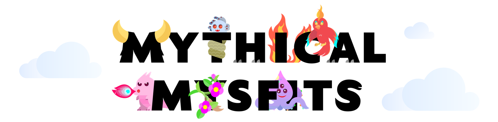
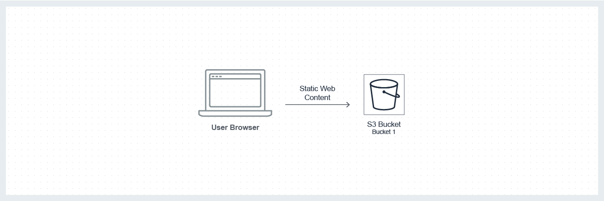

<!-- README file in MD for the Mythical Mysfits repository-->

<!--
*** Attribution and thanks: README template adapted from Othneil Drew's example, available at:
*** https://github.com/othneildrew/Best-README-Template
-->

<!-- PROJECT LOGO -->

  
   
  .NET and AWS example application for a pet adoption centre.

<!-- SHIELDS FOR REPO -->

    
    
    

<!-- TABLE OF CONTENTS -->

<!-- ABOUT THE PROJECT -->
## About the Project

            
    Note: This is a practice project, created by following the official AWS course: 
- **Source**:  [Mythical Mysfits - Build a Modern Application on AWS (C#)](https://github.com/aws-samples/aws-modern-application-workshop/tree/dotnet?tab=readme-ov-file)

### Summary

The goal of the project is to create a scalable website for ***Mythical Mysfits***, a whimsical non-profit dedicated to rescuing and rehoming abandoned mythical creatures. The website should showcase their magical creatures and enable families to adopt them easily.

To achieve this goal, the project extracts and cleans data from multiple sources and uploads them into a new central PostgreSQL database.

- `Key platforms and technologies`: AWS, .NET (C#)

(<a href="#readme-top">back to top</a>)

<!-- Project Flow -->
## Project Flow

### 1. IDE Setup and Static Website Hosting

**Services used:** [Amazon Simple Storage Service (S3)](https://aws.amazon.com/s3/)

(<a href="#readme-top">back to top</a>)

<!-- GETTING STARTED -->
## Getting started

### Required tools

The following tools will be needed for this project.
* [Visual Studio Code](https://code.visualstudio.com/)
* [AWS CLI](https://aws.amazon.com/cli/) or [AWS Tools for PowerShell](https://aws.amazon.com/powershell/): Pick a tool based on the environment you're more comfortable with, and configure your AWS access and secret keys.
* [Node.js and NPM](https://nodejs.org/en/) - v12 or greater
* [.NET Core 2.1](https://www.microsoft.com/net/download)
* [Angular CLI](https://cli.angular.io/)
* [AWS Amplify](https://aws-amplify.github.io/)

For more information on configuring the environment, see: 
[Module 1: Getting Started](https://github.com/aws-samples/aws-modern-application-workshop/tree/dotnet/module-1#getting-started-configuring-your-environment-for-mythical-mysfits)

### Credentials
To run this project, you will have to set up the following credentials and databases:

- [**AWS**](https://aws.amazon.com/?nc2=h_lg) - 

(<a href="#readme-top">back to top</a>)

<!-- LICENSE -->
## License

Distributed under the Apache 2.0 License. See `LICENSE.txt` for more information.

(<a href="#readme-top">back to top</a>)

<!-- MARKDOWN LINKS & IMAGES -->
<!-- https://www.markdownguide.org/basic-syntax/#reference-style-links -->
[url-installing-git]: https://git-scm.com/book/en/v2/Getting-Started-Installing-Git
[url-installing-python]: https://wiki.python.org/moin/BeginnersGuide/Download
